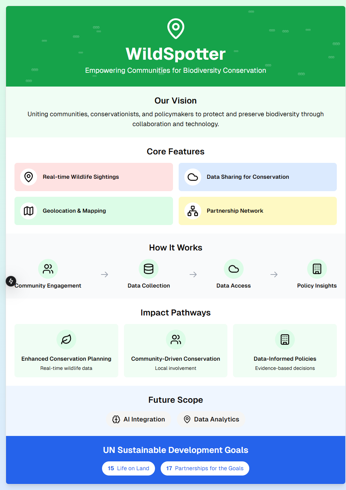

# WildSpotter

WildSpotter is a biodiversity conservation tool that maps real-time wildlife sightings to support data-driven conservation efforts. Built with Next.js, TypeScript, and Leaflet, WildSpotter emphasizes strategic partnerships for biodiversity conservation, aligning with UN SDG 17.

## Overview

WildSpotter tracks and visualizes species sightings across diverse regions. This tool aims to foster collaboration between conservation organizations, governments, and communities by providing a platform to share and analyze wildlife data.

## Key Features

- **Interactive Map**: Displays wildlife sightings using geolocation markers.
- **Real-Time Data Fetching**: Dynamically loads sightings from a custom API endpoint.
- **Community Contribution**: Facilitates data collection from local communities and organizations.
- **Responsive Design**: Optimized for viewing on both mobile and desktop.

## Technologies Used

- **Next.js** (React framework) for fast, server-rendered web applications.
- **TypeScript** for type-safe, maintainable code.
- **Leaflet** and **React-Leaflet** for interactive map functionality.

## Usage

1. **Launch the app**: Start the server with `bun run dev`.
2. **View Map**: Access the main map interface to view wildlife sightings.
3. **Interact with Markers**: Click on map markers to learn more about each sighting (species name, location).
